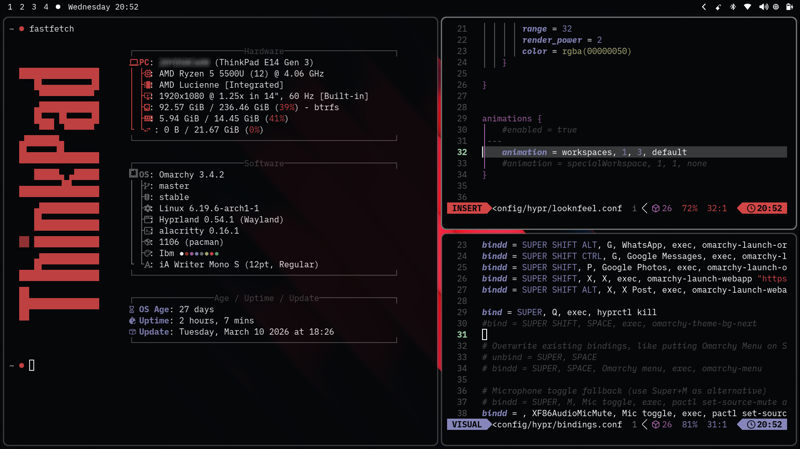

# Omarchy IBM Colorscheme

A professional, high-contrast dark colorscheme for **Omarchy Linux**, inspired by the classic IBM design language and optimized for the **Hyprland** compositor.

---

## ✨ Preview

## 🖥️ Optional: ThinkPad ASCII Logo (Fastfetch)

If you want your terminal to display a ThinkPad-style ASCII logo using `fastfetch`, you can use the following:

### 1. Horizontal logo (Fastfetch)
Save this to:
`~/.config/omarchy/branding/about.txt`

```bash

████████████████
   █▙▄▄▄▄▄▄▄▄▄▟█
    ▀▀▀▀▀▀▀▀▀▀▀
   ▄████████████
   █▙▄▄ █▙▄▄▄▄▟█
    ▀▀▀  ▀▀▀▀▀▀
▄███████▄
█▙▄▄▄▄▄▟█▄▄▄▄▄▄▄
▀▀▀▀▀▀▀▀▀▀▀▀▀▀▀▀
   █████▄ ▄█████
▄▄▄▄▄▄▄▄▟█▙▄▄▄▄▄
▀▀▀▀▀▀▀▀▀▀▀▀▀▀▀▀
   ▄████████████
   █▙▄▄▄▄▄▄▄▄▄▄▄
   ▀▀▀▀▀▀▀▀▀▀▀▀▀
▓▓ █████████████
    ▄▄▄▄▄▄▄▄▄▄▄▄
   █▛▀▀▀▀▀▀▀▀▀▀▀
████████████████
▄▄
██▄▄▄▄▄▄▄▄▄▄▄▄▄▄
██▀▀▀▀▀▀▀▀▀▀▀▀▀▀
▀▀   
```
2. screensaver (vertical) logo:
```bash
             ▄▄
██████ ██   ▝██▘      ██    ████▄          ██
  ██   ██▗▄▖ ▄▄ ▄▄▗▄▖ ██ ▄▄ ██ ██  ▄▄▄  ▗▄▖██
  ██   ██▛██ ██ ██▛██ ██ ██ ██ ██ ██▀██ ██▜██
  ██   ██ ██ ██ ██ ██ ██▐█▌ ██▄██ ▀▀▗██ ██ ██
  ██   ██ ██ ██ ██ ██ ████  ██▀▀  ▗█▛██ ██ ██
  ██   ██ ██ ██ ██ ██ ██▐█▌ ██    ██ ██ ██ ██
  ██   ██ ██ ██ ██ ██ ██ ██ ██    ██▟██ ██▟██
  ▀▀   ▀▀ ▀▀ ▀▀ ▀▀ ▀▀ ▀▀ ▀▀ ▀▀    ▝▀▘▀▀ ▝▀▘▀
```
